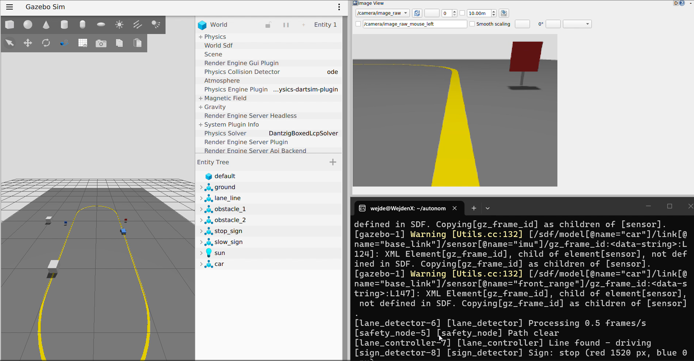
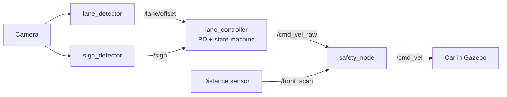
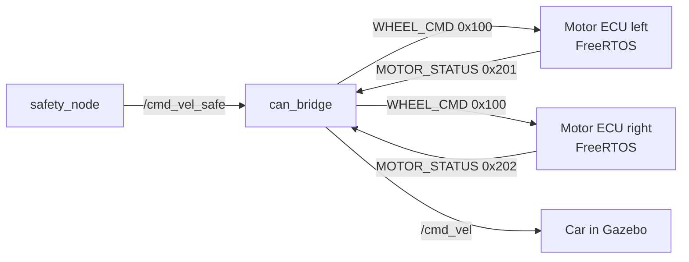

# Autonomous Robot Car

[](https://github.com/wijden1/autonomous-robot-car/actions/workflows/ci.yml)

A self-driving robot car built with **ROS 2 Jazzy**, **Gazebo Harmonic** and **OpenCV**. The car follows a lane using its camera, reacts to stop and slow signs with a state machine, and stops automatically in front of obstacles through a dedicated safety layer.

▶️ **[Watch the demo video](https://youtu.be/lhqgWsQx_aQ)**

▶️ **[CAN bus + fault test video](https://youtu.be/jLw73U_2GGI)**



## Features

- **Lane following:** OpenCV detects the yellow line in the camera image (HSV colour threshold + image moments) and a PD controller steers the car. Runs at about 22 frames per second.
- **Traffic sign detection:** red (stop) and blue (slow) signs are detected by colour and size.
- **State machine:** `DRIVE → STOP → DRIVE` at stop signs (3 s wait) and `DRIVE → SLOW → DRIVE` in slow zones.
- **Safety layer:** every driving command passes through a safety node that blocks forward motion when an obstacle is closer than 0.30 m, and also stops the car if sensor data goes missing (fail-safe).
- **Simulated sensors:** front camera, IMU and a 5-ray distance sensor.
- **Generated track:** a Python script builds the oval track world with signs and obstacles.

## Architecture



| Node | Job |
|---|---|
| `lane_detector` | Finds the lane line and publishes its offset (-1 left … +1 right) |
| `sign_detector` | Detects stop and slow signs |
| `lane_controller` | PD steering and the DRIVE / SLOW / STOP state machine |
| `safety_node` | Blocks forward driving near obstacles or when sensor data is missing |

## CAN bus software-in-the-loop (SIL)

With `use_can:=true`, the wheels are no longer driven directly by ROS 2. Every command goes over a CAN bus (Linux SocketCAN, `vcan0`) to two motor ECUs running the [FreeRTOS firmware](firmware/), and the car in Gazebo moves with the speed the motors **really** reach.



| ID | Message | Rate | Content |
|---|---|---|---|
| `0x100` | WHEEL_CMD | 20 Hz | Setpoint left/right [rpm], alive counter |
| `0x201` / `0x202` | MOTOR_STATUS | 50 Hz | Measured speed [rpm], voltage [V], state, alive counter |

- Messages defined in a DBC file ([can/robot_car.dbc](can/robot_car.dbc)), shared by the C firmware and the Python bridge
- Differential-drive kinematics and gear ratio in the bridge
- Fail-safe on both sides: ECU watchdog after 500 ms without commands, alive-counter check against frozen senders, and the car stops when an ECU stops reporting

```bash
scripts/setup_vcan.sh
ros2 launch car_description sim.launch.py use_can:=true
candump vcan0 | python3 -m cantools decode can/robot_car.dbc   # watch the bus
```

## Tech stack

ROS 2 Jazzy · Gazebo Harmonic · Python · OpenCV · NumPy · URDF/xacro · ros_gz_bridge · Ubuntu 24.04 (WSL2)

## Project structure

```
sim/src/
├── car_description/     # robot model (URDF), track world, launch file
│   ├── urdf/car.urdf.xacro
│   ├── scripts/make_track.py
│   └── launch/sim.launch.py
└── car_control/         # perception, control and safety nodes
    └── car_control/
        ├── lane_detector.py
        ├── sign_detector.py
        ├── lane_controller.py
        └── safety_node.py
```

## How to run

Requirements: Ubuntu 24.04 with ROS 2 Jazzy and Gazebo Harmonic (`ros-jazzy-desktop`, `ros-jazzy-ros-gz`, `ros-jazzy-xacro`).

```bash
cd sim/src/car_description && python3 scripts/make_track.py   # generate the track
cd ../.. && colcon build --symlink-install
source install/setup.bash
ros2 launch car_description sim.launch.py            # autonomous driving
ros2 launch car_description sim.launch.py auto:=false  # manual driving
```

For manual driving, send commands through the safety node:
```bash
ros2 run teleop_twist_keyboard teleop_twist_keyboard --ros-args -r cmd_vel:=cmd_vel_raw
```

## Roadmap

- [x] Robot model and Gazebo simulation
- [x] Camera, IMU and distance sensor
- [x] Lane following, sign detection, state machine, safety layer
- [x] Motor-control firmware in C with FreeRTOS against a DC motor model ([firmware/](firmware/))
- [x] CAN bus communication between firmware and simulation (software-in-the-loop)
- [ ] Live telemetry with MQTT, InfluxDB and Grafana in Docker
- [ ] Unit tests and CI with GitHub Actions

## Author

Wijden Slimeni · Technische Informatik student at Berliner Hochschule für Technik (BHT)